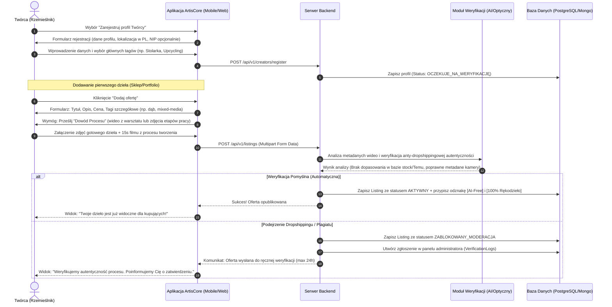
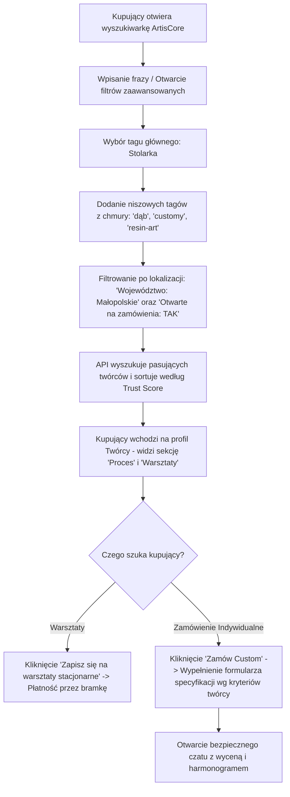

# ArtisCore — Specyfikacja Produktowa i Projekt Architektury (Master Blueprint)

ArtisCore to hybrydowa platforma łącząca sklep internetowy, portfolio artystyczne oraz przestrzeń społecznościową dla polskich twórców, rzemieślników i miłośników autentycznego rękodzieła. Projekt odpowiada na problem fragmentacji rynku oraz zalewu tanich, masowych produktów z dropshippingu (Temu, AliExpress) i grafik generowanych przez sztuczną inteligencję (AI).

---

## 1. Streszczenie Menedżerskie (Executive Summary)

### Wizja Produktu
Stworzenie bezpiecznego, „ludzkiego” ekosystemu, który łączy lokalnych polskich artystów bezpośrednio z kupującymi. ArtisCore eliminuje bariery algorytmiczne mediów społecznościowych, porządkuje chaos grup na Facebooku i zastępuje niedostosowane platformy handlowe (jak Vinted czy Allegro) dedykowanym narzędziem wspierającym autentyczność.

### Główne Problemy Rynkowe w Polsce:
1.  **Rozproszenie i chaos:** Twórcy reklamują się na grupach FB (gdzie posty szybko giną) lub sprzedają na Vinted (które jest przeznaczone na rzeczy używane, a nie unikalną sztukę).
2.  **Ucinanie zasięgów:** Instagram i TikTok promują krótkie wideo nastawione na trendy, ucinając organiczne dotarcie małym artystom i blokując linki do sklepów zewnętrznych.
3.  **Inwazja Dropshippingu i AI:** Serwisy marketplace są zalewane tanią, masową produkcją udającą rękodzieło oraz grafikami generowanymi komputerowo, co uniemożliwia uczciwą konkurencję cenową.

### Persony Użytkowników

```
+--------------------------------------------------------------------------------------------------+
| PERSONA 1: KOLEKCJONERKA GEN Z                                                                   |
+--------------------------------------------------------------------------------------------------+
| Imię: Zuzanna (22 lata, Warszawa) - Studentka ASP / Freelance Graphic Designer                   |
| Motywacje:                                                                                       |
|   - Chce, aby jej przestrzeń życiowa była unikalna i odzwierciedlała jej styl.                  |
|   - Odrzuca szybki konsumpcjonizm i masówkę z Temu; woli wydać więcej na rzecz z historią.       |
|   - Szuka bezpośredniego kontaktu z twórcą, by poznać proces powstawania dzieła.                 |
| Frustracje:                                                                                      |
|   - Trudno jej znaleźć prawdziwych twórców na Instagramie przez algorytmy wideo.                  |
|   - Na popularnych platformach handlowych większość wyników to dropshipping z Chin.              |
+--------------------------------------------------------------------------------------------------+

+--------------------------------------------------------------------------------------------------+
| PERSONA 2: LOKALNY RZEMIEŚLNIK                                                                   |
+--------------------------------------------------------------------------------------------------+
| Imię: Mateusz (34 lata, Podhale) - Stolarz, twórca autorskich mebli i dekoracji z drewna           |
| Motywacje:                                                                                       |
|   - Tworzy wysokiej jakości meble i rzeźby użytkowe z lokalnych surowców.                        |
|   - Chce organizować warsztaty stolarskie w swoim warsztacie dla małych grup.                     |
|   - Chce przyjmować zlecenia indywidualne (customy), ale na jasnych warunkach.                   |
| Frustracje:                                                                                      |
|   - Portale ogłoszeniowe (OLX, Allegro) zmuszają go do rywalizacji cenowej z fabrykami.          |
|   - Brak mu czasu i umiejętności do ciągłego nagrywania rolek na Instagrama, by mieć zasięgi.    |
+--------------------------------------------------------------------------------------------------+

+--------------------------------------------------------------------------------------------------+
| PERSONA 3: EKOLOGICZNA TWÓRCZYNI                                                                 |
+--------------------------------------------------------------------------------------------------+
| Imię: Agata (28 lata, Gdańsk) - Projektantka mody upcyklingowej i mixed-media                      |
| Motywacje:                                                                                       |
|   - Szyje unikalne ubrania z drugiego obiegu (1-of-1).                                           |
|   - Chce budować lojalną społeczność i edukować ludzi o zrównoważonym rozwoju.                   |
| Frustracje:                                                                                      |
|   - Brak jednej platformy dedykowanej dla mody upcyklingowej; Vinted blokuje konta komercyjne.  |
|   - Klienci nie rozumieją, dlaczego jej rzeczy są droższe niż sieciówki (brak ekspozycji procesu).|
+--------------------------------------------------------------------------------------------------+
```

---

## 2. Szczegółowe Mapy Podróży Użytkownika (User Journeys)

### Podróż A: Rejestracja Twórcy, Weryfikacja i Dodanie Oferty z „Dowodem Procesu”

Poniższy diagram przedstawia proces, w którym twórca rejestruje się w aplikacji, przechodzi autoryzację i dodaje ofertę, przesyłając materiały wideo/zdjęcia pokazujące etapy pracy (Proof of Process).



---

### Podróż B: Kupujący szuka spersonalizowanego zamówienia i rezerwuje warsztaty

Poniższa ścieżka opisuje, jak kupujący filtruje oferty za pomocą rozbudowanej chmury tagów i lokalizacji, weryfikuje proces twórczy i zamawia u artysty indywidualne zlecenie (Custom) lub zapisuje się na warsztaty stacjonarne.



---

## 3. Koncepcja Schematu Bazy Danych (Model Hybrydowy)

Zastosowano podejście hybrydowe:
1.  **Relacyjna Baza Danych (np. PostgreSQL):** Zapewnia integralność transakcyjną dla kont użytkowników, płatności, rezerwacji warsztatów oraz relacji encji.
2.  **Dokumentowa Baza Danych (np. MongoDB lub PostgreSQL JSONB):** Służy do obsługi dynamicznego systemu tagowania, logów weryfikacji anty-dropshippingowej i postów z procesu twórczego (WIP posts).

```
                  +---------------------------------------+
                  |         STRUKTURA BAZY DANYCH         |
                  +---------------------------------------+
                                      |
         +----------------------------+----------------------------+
         |                                                         |
         v                                                         v
   [POSTGRESQL - RDZEN]                                    [NOSQL - DOKUMENTY]
- Konta Użytkowników (Kupujący/Twórca)                   - Elastyczna Chmura Tagów
- Profile Rzemieślników (Atrybuty lokalne)               - Logi Weryfikacji (Meta-analiza wideo)
- Oferty/Listingi (Stan magazynowy, cena)                - Posty Społecznościowe (WIP, Wideo)
- Warsztaty & Rezerwacje biletów
```

### 1. Tabele Relacyjne (SQL - PostgreSQL DDL)

```sql
-- Główna tabela użytkowników
CREATE TABLE users (
    id UUID PRIMARY KEY DEFAULT gen_random_uuid(),
    email VARCHAR(255) UNIQUE NOT NULL,
    password_hash VARCHAR(255) NOT NULL,
    phone_number VARCHAR(20),
    role VARCHAR(20) NOT NULL CHECK (role IN ('buyer', 'creator', 'admin')),
    created_at TIMESTAMP WITH TIME ZONE DEFAULT CURRENT_TIMESTAMP
);

-- Profil Twórcy (rozszerzenie tabeli użytkowników)
CREATE TABLE creator_profiles (
    user_id UUID PRIMARY KEY REFERENCES users(id) ON DELETE CASCADE,
    display_name VARCHAR(150) NOT NULL,
    bio TEXT,
    city VARCHAR(100) NOT NULL,
    voivodeship VARCHAR(50) NOT NULL, -- np. 'pomorskie', 'małopolskie'
    is_open_for_commissions BOOLEAN DEFAULT FALSE,
    commission_exclusions TEXT, -- Czego artysta NIE robi (np. "nie rysuję portretów ze zdjęć")
    is_premium BOOLEAN DEFAULT FALSE,
    premium_color_theme VARCHAR(7), -- Kolor profilu Premium w formacie HEX (np. '#8B0000')
    trust_score NUMERIC(5,2) DEFAULT 75.00,
    created_at TIMESTAMP WITH TIME ZONE DEFAULT CURRENT_TIMESTAMP
);

-- Oferty sprzedaży dzieł w sklepie
CREATE TABLE listings (
    id UUID PRIMARY KEY DEFAULT gen_random_uuid(),
    creator_id UUID NOT NULL REFERENCES creator_profiles(user_id) ON DELETE CASCADE,
    title VARCHAR(200) NOT NULL,
    description TEXT NOT NULL,
    price_pln DECIMAL(10, 2) NOT NULL,
    inventory_count INT NOT NULL DEFAULT 1,
    status VARCHAR(30) NOT NULL DEFAULT 'pending_verification' CHECK (status IN ('draft', 'pending_verification', 'active', 'sold', 'reported')),
    shipping_options JSONB, -- Opcje wysyłki w PL (np. InPost paczkomaty, kurier, odbiór osobisty)
    created_at TIMESTAMP WITH TIME ZONE DEFAULT CURRENT_TIMESTAMP
);

-- Warsztaty stacjonarne organizowane przez Twórców
CREATE TABLE workshops (
    id UUID PRIMARY KEY DEFAULT gen_random_uuid(),
    creator_id UUID NOT NULL REFERENCES creator_profiles(user_id) ON DELETE CASCADE,
    title VARCHAR(200) NOT NULL,
    description TEXT NOT NULL,
    price_pln DECIMAL(10,2) NOT NULL,
    max_spots INT NOT NULL,
    available_spots INT NOT NULL,
    event_date TIMESTAMP WITH TIME ZONE NOT NULL,
    address TEXT NOT NULL,
    city VARCHAR(100) NOT NULL,
    created_at TIMESTAMP WITH TIME ZONE DEFAULT CURRENT_TIMESTAMP
);

-- Rezerwacje biletów na warsztaty
CREATE TABLE workshop_bookings (
    id UUID PRIMARY KEY DEFAULT gen_random_uuid(),
    workshop_id UUID NOT NULL REFERENCES workshops(id) ON DELETE CASCADE,
    buyer_id UUID NOT NULL REFERENCES users(id) ON DELETE CASCADE,
    ticket_count INT NOT NULL DEFAULT 1,
    total_paid DECIMAL(10,2) NOT NULL,
    payment_status VARCHAR(30) DEFAULT 'pending' CHECK (payment_status IN ('pending', 'completed', 'refunded', 'cancelled')),
    created_at TIMESTAMP WITH TIME ZONE DEFAULT CURRENT_TIMESTAMP
);
```

### 2. Kolekcje Dokumentowe (NoSQL)

#### Kolekcja: `Tags` (Struktura taksonomii tagów)
Umożliwia dynamiczne rozwijanie drzewa kategorii i tagów niszowych bez modyfikacji schematu tabel SQL.
```json
{
  "_id": "tag_crochet_01",
  "slug": "szydełko",
  "display_name_pl": "Szydełko",
  "category": "secondary",
  "parent_tag": "rekodzielo", // Tag nadrzędny
  "synonyms": ["szydełkowanie", "maskotki", "amigurumi", "włóczka"],
  "usage_count": 829,
  "is_custom_user_tag": false,
  "is_approved": true
}
```

#### Kolekcja: `VerificationLogs` (Logi weryfikacji anty-dropshippingowej)
Przechowuje surowe wyniki testów autentyczności wideo z procesu tworzenia.
```json
{
  "_id": "vlog_8892182",
  "listing_id": "7a3bdf8d-4a1d-4bbd-9ddd-1b0d7b3dcb6d",
  "creator_id": "1c984fd4-8b9a-4c22-b9e3-cf2980c98f92",
  "verification_layers": [
    {
      "media_type": "video",
      "s3_url": "vids/proofs/2026/05/proof_crochet_process.mp4",
      "duration_seconds": 15.4,
      "metadata": {
        "device_model": "iPhone 15 Pro",
        "gps_latitude": 54.3520,
        "gps_longitude": 18.6466,
        "creation_time": "2026-05-26T15:20:00Z"
      }
    }
  ],
  "automated_checks": {
    "is_stock_video_score": 0.01,
    "ai_generated_probability": 0.00,
    "image_metadata_altered": false,
    "reverse_lookup_duplicates": 0
  },
  "verdict": "AUTO_APPROVED",
  "checked_at": "2026-05-26T15:21:05Z"
}
```

---

## 4. Algorytm Pozycjonowania i Zaufania (Trust & Authenticity Score)

Algorytm ArtisCore ma na celu promowanie uczciwych, rzetelnych i aktywnych polskich twórców. System nie promuje najtańszych produktów z masowej produkcji, lecz bazuje na wskaźnikach autentyczności i jakości obsługi klienta.

### Metryki i Wagi Algorytmu

| Komponent algorytmu | Waga ($w_i$) | Metoda pomiaru |
| :--- | :--- | :--- |
| **Głębokość Weryfikacji (Verification)** | $w_1 = 0.40$ | Procent ofert ofert posiadających zweryfikowane wideo z procesu powstawania ("Proof of Process"). |
| **Czas Reakcji (Responsiveness)** | $w_2 = 0.20$ | Średni czas odpowiedzi na wiadomości od kupujących i zapytania o zamówienia indywidualne. |
| **Puntualność Wysyłki (Shipping)** | $w_3 = 0.25$ | Odsetek przesyłek nadanych w zadeklarowanym terminie ( integracja z InPost/kurierami). |
| **Aktywność na platformie (Activity)** | $w_4 = 0.15$ | Częstotliwość publikowania aktualizacji z warsztatu (posty WIP, wideo z procesu, dodawanie warsztatów). |

### System Kar (Deductions):
*   **Zgłoszenie dropshippingu (-15 pkt):** Uzasadnione zgłoszenie od społeczności (np. wskazanie oferty na Temu) skutkuje natychmiastowym obniżeniem oceny do czasu wyjaśnienia przez moderatora.
*   **Opóźnienie wysyłki powyżej 48h (-5 pkt):** Każde nieterminowe nadanie paczki bez wcześniejszego poinformowania klienta.
*   **Ostrzeżenie administratora (-30 pkt):** Naruszenie regulaminu społeczności.

### Implementacja Algorytmu (TypeScript)

```typescript
interface CreatorMetrics {
  verificationPercentage: number;   // 0 - 100 (% ofert z weryfikacją wideo procesu)
  avgResponseTimeInMinutes: number; // Średni czas odpowiedzi w minutach
  lateShippingRatio: number;        // Odsetek spóźnionych wysyłek (wartość od 0.0 do 1.0)
  daysSinceLastActivity: number;    // Dni od ostatniego posta WIP / wideo / edycji profilu
  validDropshippingFlags: number;   // Potwierdzone zgłoszenia dropshippingu
  systemWarnings: number;           // Ostrzeżenia od moderatorów
}

const CONFIG = {
  WEIGHTS: {
    VERIFICATION: 0.40,
    RESPONSIVENESS: 0.20,
    SHIPPING: 0.25,
    ACTIVITY: 0.15
  },
  PENALTIES: {
    DROPSHIP_FLAG: 15.00,
    SYSTEM_WARNING: 30.00
  }
};

/**
 * Oblicza ostateczny wskaźnik zaufania i autentyczności twórcy (0 - 100).
 */
export function calculateTrustScore(metrics: CreatorMetrics): number {
  // 1. Ocena weryfikacji procesu (wprost z procentu zweryfikowanych ofert)
  const vScore = metrics.verificationPercentage;

  // 2. Ocena responsywności (krzywa logarytmiczna: szybki kontakt premiowany, długi karany)
  let rScore = 0;
  if (metrics.avgResponseTimeInMinutes <= 15) {
    rScore = 100;
  } else {
    // Spadek punktacji: 1 godzina = ~80 pkt, 4 godziny = ~55 pkt, 24 godziny = 10 pkt
    rScore = Math.max(10, 100 - 18 * Math.log2(metrics.avgResponseTimeInMinutes / 15));
  }

  // 3. Ocena logistyki i wysyłki (odwrotność opóźnień)
  const sScore = Math.max(0, (1 - metrics.lateShippingRatio) * 100);

  // 4. Ocena aktywności (spadek punktacji o 5 pkt za każdy dzień bezczynności)
  const aScore = Math.max(0, 100 - (metrics.daysSinceLastActivity * 5));

  // Sumowanie wag
  let baseScore = (vScore * CONFIG.WEIGHTS.VERIFICATION) +
                  (rScore * CONFIG.WEIGHTS.RESPONSIVENESS) +
                  (sScore * CONFIG.WEIGHTS.SHIPPING) +
                  (aScore * CONFIG.WEIGHTS.ACTIVITY);

  // Odliczenie kar punktowych
  const totalPenalties = (metrics.validDropshippingFlags * CONFIG.PENALTIES.DROPSHIP_FLAG) +
                         (metrics.systemWarnings * CONFIG.PENALTIES.SYSTEM_WARNING);

  const finalScore = Math.max(0, Math.min(100, baseScore - totalPenalties));
  return parseFloat(finalScore.toFixed(2));
}

/**
 * Zwraca modyfikator pozycji na liście wyszukiwania i w kanale głównym feedu.
 */
export function getFeedBoostMultiplier(trustScore: number, isPremium: boolean): number {
  let multiplier = 1.0;

  if (trustScore < 50) {
    multiplier = 0.20; // Depozycjonowanie o 80% (brak widoczności dla podejrzanych kont)
  } else if (trustScore < 70) {
    multiplier = 0.70; // Lekkie depozycjonowanie o 30%
  } else if (trustScore >= 90) {
    multiplier = 1.30; // Boost organiczny o 30% za wysoką autentyczność
  }

  // Uczciwe promowanie kont Premium (tylko gdy mają wysoki Trust Score)
  if (isPremium && trustScore >= 70) {
    multiplier += 0.15; // Dodatkowe +15% widoczności
  }

  return multiplier;
}
```

---

## 5. Makiety UX/UI (Wireframes)

### Wizualna Struktura Ekranów Aplikacji

#### Ekran A: Feed Główny (Odkrywanie sztuki oparte o autentyczność)

```
+-------------------------------------------------------------------+
|  [ArtisCore Logo]               [Lokalizacja: Trójmiasto]  [Szukaj] |
+-------------------------------------------------------------------+
|  [ Wszystko ]  [ Sztuka Piękna ]  [ Ceramika ]  [ Warsztaty ]     |
+-------------------------------------------------------------------+
|                                                                   |
|  +-------------------------------------------------------------+  |
|  |  (Avatar) Michał Szary (Gdańsk)               [Trust: 98%]  |  |
|  |  Tagi: #stolarka #dąb #customy                              |  |
|  |  +-------------------------------------------------------+  |  |
|  |  |                                                       |  |  |
|  |  |                 [ Główne Zdjęcie Produktu ]            |  |  |
|  |  |                                                       |  |  |
|  |  +-------------------------------------------------------+  |  |
|  |  | [Wideo: 15s] Obejrzyj jak rzeźbiłem ten stolik        |  |  |
|  |  +-------------------------------------------------------+  |  |
|  |  "Dębowy Stolik Kawowy z Zieloną Żywicą"                    |  |
|  |  Cena: 1 450 PLN                                  [Kup teraz]|  |
|  +-------------------------------------------------------------+  |
|                                                                   |
|  +-------------------------------------------------------------+  |
|  |  (Avatar) Karolina Szyje (Sopot)              [Trust: 95%]  |  |
|  |  Tagi: #szydełko #amigurumi #eko                            |  |
|  |  [Post WIP] "Właśnie kończę nową maskotkę z wełny alpaki.   |  |
|  |  Zobaczcie kulisy pracy nad oczami..."                      |  |
|  |  +-------------------------------------------------------+  |  |
|  |  |          [ Karuzela Zdjęć Zza Kulis Warsztatu ]       |  |  |
|  |  +-------------------------------------------------------+  |  |
|  +-------------------------------------------------------------+  |
+-------------------------------------------------------------------+
|   [Home]        [Odkryj]        [Dodaj +]      [Czat]     [Profil] |
+-------------------------------------------------------------------+
```

#### Ekran B: Porównanie Profili Twórcy (Konto Darmowe vs. Premium)

```
=====================================================================
                    PROFIL TWÓRCY: KONTO DARMOWE
=====================================================================
+-------------------------------------------------------------------+
| [Wstecz]                                             [Udostępnij] |
|                                                                   |
|       (  AVATAR  )          Janusz Rzeźbiarz                      |
|                             Lokalizacja: Zakopane                 |
|                             Trust Score: [ 82% ]                  |
|                                                                   |
|   Bio: Tradycyjne rzeźbiarstwo podhalańskie. Tworzę z drewna lipy. |
|   [ Zamówienia Indywidualne: NIE PRZYJMUJĘ ]                      |
+-------------------------------------------------------------------+
|  [ Oferta (6) ]           [ O mnie ]          [ Recenzje (14) ]   |
+-------------------------------------------------------------------+
|   Standardowa siatka produktów (szablon dwukolumnowy):            |
|   +-------------------+  +-------------------+                    |
|   | [Zdjęcie]         |  | [Zdjęcie]         |                    |
|   | Figurka Niedźwiedź|  | Drewniana miska   |                    |
|   | 250 PLN           |  | 120 PLN           |                    |
|   +-------------------+  +-------------------+                    |
+-------------------------------------------------------------------+

=====================================================================
                    PROFIL TWÓRCY: KONTO PREMIUM
=====================================================================
+-------------------------------------------------------------------+
| [Wstecz]                                             [Udostępnij] |
|  [Autorskie Zdjęcie w Tle - Widok na warsztat szklarski we Wrocławiu] |
|                                                                   |
|  (   AVATAR   )   Zofia Szkło (Konto Premium)                     |
|                   Miejscowość: Wrocław                            |
|                   Reputacja: [ [Zaufany Twórca] 98% Autentyczność ]|
|                                                                   |
|  "Artystyczne fusingowanie szkła. Tworzę witraże i biżuterię."     |
|  [🟢 Otwarte na Zamówienia Indywidualne]                           |
|  * Wykluczenia: Nie wykonuję rekonstrukcji zabytków sakralnych.    |
+-------------------------------------------------------------------+
|  [ Wyróżnione ]  [ Sklep ]  [ Portfolio ]  [ Warsztaty ]  [ Opinie ] |
+-------------------------------------------------------------------+
|   DYNAMICZNY UKŁAD HERO (Wyróżnienie autorskich filmów i galerii) |
|   +-----------------------------------------------------------+   |
|   | [Odtwarzacz Wideo Hero: Proces wypalania szkła w piecu]   |   |
|   | Kolekcja 'Magia Ognia' - Zobacz proces powstawania patery  |   |
|   +-----------------------------------------------------------+   |
|   | +-----------------------+   +-----------------------+     |   |
|   | | [Foto] Witraż leśny   |   | [Foto] Broszka fusing |     |   |
|   | | 890 PLN  [Kup Teraz]  |   | | 120 PLN  [Kup Teraz]  |     |   |
|   | +-----------------------+   +-----------------------+     |   |
|   +-----------------------------------------------------------+   |
|                                                                   |
|   NADCHODZĄCE WARSZTATY STACJONARNE                               |
|   +-----------------------------------------------------------+   |
|   | [Karta warsztatu] "Tworzenie biżuterii szklanej" - Wrocław |   |
|   | Termin: 15 Czerwca 2026 | Cena: 250 PLN   [Zapisz się]    |   |
|   +-----------------------------------------------------------+   |
+-------------------------------------------------------------------+
```

#### Ekran C: Zaawansowane Filtrowanie i Chmura Tagów

```
+-------------------------------------------------------------------+
|  [<-]  [ Szukaj rękodzieła, artystów, warsztatów...          ]    |
+-------------------------------------------------------------------+
|  KATEGORIE GŁÓWNE (Główne Tagi Szerokie)                          |
|  ( Sztuka Piękna )   ( Rękodzieło )   ( Upcycling )   ( Stolarka )|
+-------------------------------------------------------------------+
|  DOPRECYZUJ DZIEDZINĘ (Chmura dynamicznych tagów niszowych)       |
|  [+] ceramika   [+] linoryt   [+] szydełko   [+] makrama          |
|  [x] mixed-media (usuń)   [x] customy (usuń)                      |
+-------------------------------------------------------------------+
|  GEOLOKALIZACJA (Filtrowanie regionalne)                          |
|  Województwo: [ Pomorskie                     v ]                  |
|  Maksymalna odległość od Twojej pozycji:                          |
|  (====o------------------------------------------) 20 km          |
+-------------------------------------------------------------------+
|  WERYFIKACJA AUTENTYCZNOŚCI                                       |
|  [x] Tylko oferty z wideo "Proof of Process" (Zza kulis warsztatu)|
|  [x] Oznaczone jako [AI-Free Verify]                              |
|  [ ] Użycie wyłącznie lokalnych polskich surowców                 |
+-------------------------------------------------------------------+
|  ZAMÓWIENIA DEDYKOWANE                                             |
|  [x] Pokaż tylko artystów gotowych na zlecenia indywidualne       |
+-------------------------------------------------------------------+
|                      [ Pokaż Wyniki (28) ]                        |
+-------------------------------------------------------------------+
```

---

## 6. Plan Weryfikacji i Wdrażania Systemowego

### Faza Weryfikacji (Testing):
1.  **Testy Integracyjne Modułu Weryfikacji:** Sprawdzenie mechanizmu blokowania listingów bez dowodów procesu.
2.  **Symulacja Algorytmu Trust Score:** Przeprowadzenie testów behawioralnych symulujących boty i konta dropshippingowe celem potwierdzenia ich depozycjonowania w wyszukiwarce.
3.  **Zamknięta Beta (50 polskich artystów):** Zaproszenie twórców z Trójmiasta i Krakowa do przetestowania ścieżki przesyłania filmów wideo oraz konfiguracji wykluczeń zleceń niestandardowych.
