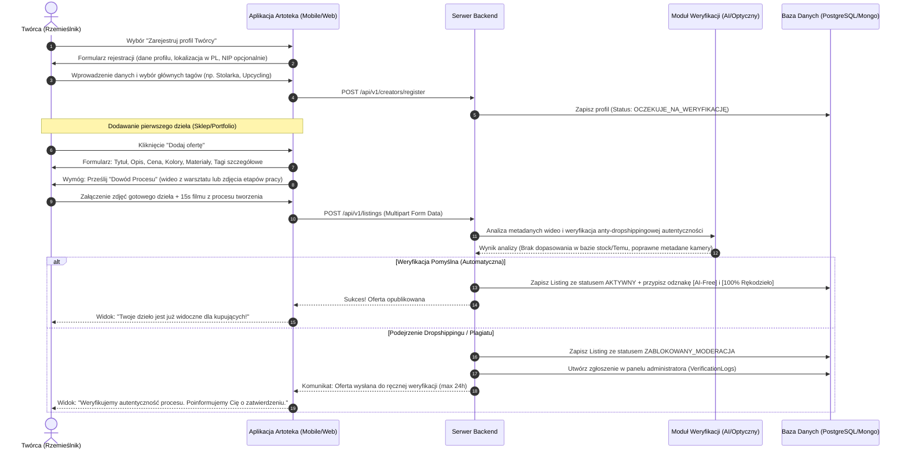
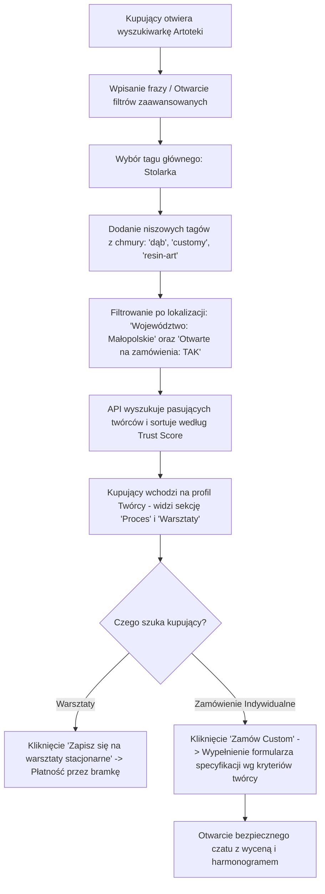

# Artoteka — Specyfikacja Produktowa i Projekt Architektury (Master Blueprint)

Artoteka to hybrydowa platforma łącząca sklep internetowy, portfolio artystyczne oraz przestrzeń społecznościową dla polskich twórców, rzemieślników i miłośników autentycznego rękodzieła. Projekt odpowiada na problem fragmentacji rynku oraz zalewu tanich, masowych produktów z dropshippingu (Temu, AliExpress) i grafik generowanych przez sztuczną inteligencję (AI).

---

## 1. Streszczenie Menedżerskie (Executive Summary)

### Wizja Produktu
Stworzenie bezpiecznego, „ludzkiego” ekosystemu o nazwie **Artoteka**, który łączy lokalnych polskich artystów bezpośrednio z kupującymi. Aplikacja eliminuje bariery algorytmiczne mediów społecznościowych, porządkuje chaos grup na Facebooku i zastępuje niedostosowane platformy handlowe (jak Vinted czy Allegro) dedykowanym narzędziem wspierającym autentyczność.

### Główne Cele Systemu:
1.  **Szeroki wachlarz kategorii (Taksonomia nisz):** Od malarstwa wielkoformatowego (murali), przez stolarstwo artystyczne, ceramikę kamionkową, aż po niszowe szydełkowanie (amigurumi, upcykling).
2.  **Szczegółowa specyfikacja dzieł:** Każda oferta zawiera precyzyjny opis materiałów (np. drewno dębowe, wełna merino, miedź) oraz wiodących kolorów dominujących (np. terracotta, butelkowa zieleń).
3.  **Wyszukiwanie dwukierunkowe:** Umożliwienie kupującemu wyszukiwania zarówno po **przedmiotach** (np. „wazon”, „kardigan”, „stół”), jak i po **zawodach/fachu** rzemieślnika (np. „malarz”, „muralista”, „ceramik”, „stolarz”, „szydełkujący”).
4.  **Zapora anty-dropshippingowa:** Wymóg przesyłania materiałów wideo zza kulis procesu powstawania ("Proof of Process").

### Persony Użytkowników

```
+--------------------------------------------------------------------------------------------------+
| PERSONA 1: KOLEKCJONERKA GEN Z                                                                   |
+--------------------------------------------------------------------------------------------------+
| Imię: Zuzanna (22 lata, Warszawa) - Studentka ASP / Freelance Graphic Designer                   |
| Motywacje:                                                                                       |
|   - Chce, aby jej przestrzeń życiowa była unikalna i odzwierciedlała jej styl.                  |
|   - Odrzuca szybki konsumpcjonizm i masówkę z Temu; woli wydać więcej na rzecz z historią.       |
|   - Szuka bezpośredniego kontaktu z twórcą, by poznać proces powstawania dzieła.                 |
| Frustracje:                                                                                      |
|   - Trudno jej znaleźć prawdziwych twórców na Instagramie przez algorytmy wideo.                  |
|   - Na popularnych platformach handlowych większość wyników to dropshipping z Chin.              |
+--------------------------------------------------------------------------------------------------+

+--------------------------------------------------------------------------------------------------+
| PERSONA 2: LOKALNY RZEMIEŚLNIK                                                                   |
+--------------------------------------------------------------------------------------------------+
| Imię: Mateusz (34 lata, Podhale) - Stolarz, twórca autorskich mebli i dekoracji z drewna           |
| Motywacje:                                                                                       |
|   - Tworzy wysokiej jakości meble i rzeźby użytkowe z lokalnych surowców.                        |
|   - Chce organizować warsztaty stolarskie w swoim warsztacie dla małych grup.                     |
|   - Chce przyjmować zlecenia indywidualne (customy), ale na jasnych warunkach.                   |
| Frustracje:                                                                                      |
|   - Portale ogłoszeniowe (OLX, Allegro) zmuszają go do rywalizacji cenowej z fabrykami.          |
|   - Brak mu czasu i umiejętności do ciągłego nagrywania rolek na Instagrama, by mieć zasięgi.    |
+--------------------------------------------------------------------------------------------------+

+--------------------------------------------------------------------------------------------------+
| PERSONA 3: EKOLOGICZNA TWÓRCZYNI                                                                 |
+--------------------------------------------------------------------------------------------------+
| Imię: Agata (28 lata, Gdańsk) - Projektantka mody upcyklingowej i mixed-media                      |
| Motywacje:                                                                                       |
|   - Szyje unikalne ubrania z drugiego obiegu (1-of-1).                                           |
|   - Chce budować lojalną społeczność i edukować ludzi o zrównoważonym rozwoju.                   |
| Frustracje:                                                                                      |
|   - Brak jednej platformy dedykowanej dla mody upcyklingowej; Vinted blokuje konta komercyjne.  |
|   - Klienci nie rozumieją, dlaczego jej rzeczy są droższe niż sieciówki (brak ekspozycji procesu).|
+--------------------------------------------------------------------------------------------------+
```

---

## 2. Szczegółowe Mapy Podróży Użytkownika (User Journeys)

### Podróż A: Rejestracja Twórcy, Weryfikacja i Dodanie Oferty z „Dowodem Procesu”

Poniższy diagram przedstawia proces, w którym twórca rejestruje się w aplikacji, przechodzi autoryzację i dodaje ofertę, przesyłając materiały wideo/zdjęcia pokazujące etapy pracy (Proof of Process).



---

### Podróż B: Kupujący szuka spersonalizowanego zamówienia i rezerwuje warsztaty

Poniższa ścieżka opisuje, jak kupujący filtruje oferty za pomocą rozbudowanej chmury tagów i lokalizacji, weryfikuje proces twórczy i zamawia u artysty indywidualne zlecenie (Custom) lub zapisuje się na warsztaty stacjonarne.



---

## 3. Koncepcja Schematu Bazy Danych (Model Hybrydowy)

Zastosowano podejście hybrydowe:
1.  **Relacyjna Baza Danych (np. PostgreSQL):** Zapewnia integralność transakcyjną dla kont użytkowników, płatności, rezerwacji warsztatów oraz relacji encji.
2.  **Dokumentowa Baza Danych (np. MongoDB lub PostgreSQL JSONB):** Służy do obsługi dynamicznego systemu tagowania, logów weryfikacji anty-dropshippingowej i postów z procesu twórczego (WIP posts).

```
                  +---------------------------------------+
                  |         STRUKTURA BAZY DANYCH         |
                  +---------------------------------------+
                                      |
         +----------------------------+----------------------------+
         |                                                         |
         v                                                         v
   [POSTGRESQL - RDZEN]                                    [NOSQL - DOKUMENTY]
- Konta Użytkowników (Kupujący/Twórca)                   - Elastyczna Chmura Tagów
- Profile Rzemieślników (Atrybuty lokalne)               - Logi Weryfikacji (Meta-analiza wideo)
- Oferty/Listingi (Stan magazynowy, cena)                - Posty Społecznościowe (WIP, Wideo)
- Warsztaty & Rezerwacje biletów
```

### 1. Tabele Relacyjne (SQL - PostgreSQL DDL)

```sql
-- Główna tabela użytkowników
CREATE TABLE users (
    id UUID PRIMARY KEY DEFAULT gen_random_uuid(),
    email VARCHAR(255) UNIQUE NOT NULL,
    password_hash VARCHAR(255) NOT NULL,
    phone_number VARCHAR(20),
    role VARCHAR(20) NOT NULL CHECK (role IN ('buyer', 'creator', 'admin')),
    created_at TIMESTAMP WITH TIME ZONE DEFAULT CURRENT_TIMESTAMP
);

-- Profil Twórcy (rozszerzenie tabeli użytkowników)
CREATE TABLE creator_profiles (
    user_id UUID PRIMARY KEY REFERENCES users(id) ON DELETE CASCADE,
    display_name VARCHAR(150) NOT NULL,
    bio TEXT,
    city VARCHAR(100) NOT NULL,
    voivodeship VARCHAR(50) NOT NULL, -- np. 'pomorskie', 'małopolskie'
    profession VARCHAR(100) NOT NULL, -- Zawód np. 'Stolarz artystyczny', 'Muralista'
    is_open_for_commissions BOOLEAN DEFAULT FALSE,
    commission_exclusions TEXT, -- Czego artysta NIE robi (np. "nie rysuję portretów ze zdjęć")
    is_premium BOOLEAN DEFAULT FALSE,
    premium_color_theme VARCHAR(7), -- Kolor profilu Premium w formacie HEX (np. '#8B0000')
    trust_score NUMERIC(5,2) DEFAULT 75.00,
    created_at TIMESTAMP WITH TIME ZONE DEFAULT CURRENT_TIMESTAMP
);

-- Oferty sprzedaży dzieł w sklepie
CREATE TABLE listings (
    id UUID PRIMARY KEY DEFAULT gen_random_uuid(),
    creator_id UUID NOT NULL REFERENCES creator_profiles(user_id) ON DELETE CASCADE,
    title VARCHAR(200) NOT NULL,
    description TEXT NOT NULL,
    price_pln DECIMAL(10, 2) NOT NULL,
    inventory_count INT NOT NULL DEFAULT 1,
    category VARCHAR(50) NOT NULL, -- np. 'Ceramika', 'Stolarka'
    item_type VARCHAR(50) NOT NULL, -- Przedmiot np. 'wazon', 'kardigan', 'obraz'
    materials JSONB NOT NULL, -- Lista użytych materiałów (np. ["miedź", "bursztyn"])
    colors JSONB NOT NULL, -- Lista dominujących kolorów (np. ["terracotta", "turkusowy"])
    status VARCHAR(30) NOT NULL DEFAULT 'pending_verification' CHECK (status IN ('draft', 'pending_verification', 'active', 'sold', 'reported')),
    shipping_options JSONB, -- Opcje wysyłki w PL (np. InPost paczkomaty, kurier, odbiór osobisty)
    created_at TIMESTAMP WITH TIME ZONE DEFAULT CURRENT_TIMESTAMP
);

-- Warsztaty stacjonarne organizowane przez Twórców
CREATE TABLE workshops (
    id UUID PRIMARY KEY DEFAULT gen_random_uuid(),
    creator_id UUID NOT NULL REFERENCES creator_profiles(user_id) ON DELETE CASCADE,
    title VARCHAR(200) NOT NULL,
    description TEXT NOT NULL,
    price_pln DECIMAL(10,2) NOT NULL,
    max_spots INT NOT NULL,
    available_spots INT NOT NULL,
    event_date TIMESTAMP WITH TIME ZONE NOT NULL,
    address TEXT NOT NULL,
    city VARCHAR(100) NOT NULL,
    created_at TIMESTAMP WITH TIME ZONE DEFAULT CURRENT_TIMESTAMP
);

-- Rezerwacje biletów na warsztaty
CREATE TABLE workshop_bookings (
    id UUID PRIMARY KEY DEFAULT gen_random_uuid(),
    workshop_id UUID NOT NULL REFERENCES workshops(id) ON DELETE CASCADE,
    buyer_id UUID NOT NULL REFERENCES users(id) ON DELETE CASCADE,
    ticket_count INT NOT NULL DEFAULT 1,
    total_paid DECIMAL(10,2) NOT NULL,
    payment_status VARCHAR(30) DEFAULT 'pending' CHECK (payment_status IN ('pending', 'completed', 'refunded', 'cancelled')),
    created_at TIMESTAMP WITH TIME ZONE DEFAULT CURRENT_TIMESTAMP
);
```

### 2. Kolekcje Dokumentowe (NoSQL)

#### Kolekcja: `Tags` (Struktura taksonomii tagów)
Umożliwia dynamiczne rozwijanie drzewa kategorii i tagów niszowych bez modyfikacji schematu tabel SQL.
```json
{
  "_id": "tag_crochet_01",
  "slug": "szydełko",
  "display_name_pl": "Szydełko",
  "category": "secondary",
  "parent_tag": "rekodzielo", // Tag nadrzędny
  "synonyms": ["szydełkowanie", "maskotki", "amigurumi", "włóczka"],
  "usage_count": 829,
  "is_custom_user_tag": false,
  "is_approved": true
}
```

#### Kolekcja: `VerificationLogs` (Logi weryfikacji anty-dropshippingowej)
Przechowuje surowe wyniki testów autentyczności wideo z procesu tworzenia.
```json
{
  "_id": "vlog_8892182",
  "listing_id": "7a3bdf8d-4a1d-4bbd-9ddd-1b0d7b3dcb6d",
  "creator_id": "1c984fd4-8b9a-4c22-b9e3-cf2980c98f92",
  "verification_layers": [
    {
      "media_type": "video",
      "s3_url": "vids/proofs/2026/05/proof_crochet_process.mp4",
      "duration_seconds": 15.4,
      "metadata": {
        "device_model": "iPhone 15 Pro",
        "gps_latitude": 54.3520,
        "gps_longitude": 18.6466,
        "creation_time": "2026-05-26T15:20:00Z"
      }
    }
  ],
  "automated_checks": {
    "is_stock_video_score": 0.01,
    "ai_generated_probability": 0.00,
    "image_metadata_altered": false,
    "reverse_lookup_duplicates": 0
  },
  "verdict": "AUTO_APPROVED",
  "checked_at": "2026-05-26T15:21:05Z"
}
```

---

## 4. Algorytm Pozycjonowania i Zaufania (Trust & Authenticity Score)

Algorytm Artoteki ma na celu promowanie uczciwych, rzetelnych i aktywnych polskich twórców. System nie promuje najtańszych produktów z masowej produkcji, lecz bazuje na wskaźnikach autentyczności i jakości obsługi klienta.

### Metryki i Wagi Algorytmu

| Komponent algorytmu | Waga ($w_i$) | Metoda pomiaru |
| :--- | :--- | :--- |
| **Głębokość Weryfikacji (Verification)** | $w_1 = 0.40$ | Procent ofert posiadających zweryfikowane wideo z procesu powstawania ("Proof of Process"). |
| **Czas Reakcji (Responsiveness)** | $w_2 = 0.20$ | Średni czas odpowiedzi na wiadomości od kupujących i zapytania o zamówienia indywidualne. |
| **Puntualność Wysyłki (Shipping)** | $w_3 = 0.25$ | Odsetek przesyłek nadanych w zadeklarowanym terminie ( integracja z InPost/kurierami). |
| **Aktywność na platformie (Activity)** | $w_4 = 0.15$ | Częstotliwość publikowania aktualizacji z warsztatu (posty WIP, wideo z procesu, dodawanie warsztatów). |

### System Kar (Deductions):
*   **Zgłoszenie dropshippingu (-15 pkt):** Uzasadnione zgłoszenie od społeczności (np. wskazanie oferty na Temu) skutkuje natychmiastowym obniżeniem oceny do czasu wyjaśnienia przez moderatora.
*   **Opóźnienie wysyłki powyżej 48h (-5 pkt):** Każde nieterminowe nadanie paczki bez wcześniejszego poinformowania klienta.
*   **Ostrzeżenie administratora (-30 pkt):** Naruszenie regulaminu społeczności.

---

## 5. Makiety UX/UI (Wireframes)

### Wizualna Struktura Ekranów Aplikacji

#### Ekran A: Feed Główny (Odkrywanie sztuki oparte o autentyczność)

```
+-------------------------------------------------------------------+
|  [Artoteka Logo]                [Lokalizacja: Trójmiasto]  [Szukaj] |
+-------------------------------------------------------------------+
|  [ Wszystko ]  [ Malarstwo ]  [ Ceramika ]  [ Murale ] [ Stolarka ]|
+-------------------------------------------------------------------+
|                                                                   |
|  +-------------------------------------------------------------+  |
|  |  (Avatar) Michał Szary (Gdańsk)               [Trust: 98%]  |  |
|  |  Malarz & Muralista | Tagi: #mural #farby-akrylowe          |  |
|  |  +-------------------------------------------------------+  |  |
|  |  |                                                       |  |  |
|  |  |                 [ Główne Zdjęcie Produktu ]            |  |  |
|  |  |                                                       |  |  |
|  |  +-------------------------------------------------------+  |  |
|  |  | [Wideo: 15s] Obejrzyj jak malowałem ten mural         |  |  |
|  |  +-------------------------------------------------------+  |  |
|  |  "Mural ścienny 'Leśne Ukojenie' - na wymiar"               |  |
|  |  Kolory: butelkowa zieleń, ochra | Materiały: farby akrylowe|  |
|  |  Cena: 3 200 PLN                                  [Kup teraz]|  |
|  +-------------------------------------------------------------+  |
+-------------------------------------------------------------------+
|   [Home]        [Odkryj]        [Dodaj +]      [Czat]     [Profil] |
+-------------------------------------------------------------------+
```

#### Ekran B: Zaawansowane Filtrowanie i Chmura Tagów

```
+-------------------------------------------------------------------+
|  [<-]  [ Szukaj przedmiotu (wazon, stół) lub fachu (stolarz)...]  |
+-------------------------------------------------------------------+
|  TRYB WYSZUKIWANIA                                                |
|  [ X Szukaj Przedmiotów ]           [   Szukaj Artystów/Zawodów  ] |
+-------------------------------------------------------------------+
|  KATEGORIE GŁÓWNE (Główne Tagi Szerokie)                          |
|  ( Malarstwo )   ( Ceramika )   ( Stolarka )   ( Szydełko )       |
+-------------------------------------------------------------------+
|  MATERIAŁ WYKONANIA                                               |
|  [+] miedź   [x] glina kamionkowa (usuń)   [+] drewno dębowe      |
|  [+] wełna merino   [+] szkło fusing                              |
+-------------------------------------------------------------------+
|  KOLOR WIODĄCY                                                    |
|  [x] terracotta (usuń)   [+] butelkowa zieleń   [+] piaskowy beż  |
+-------------------------------------------------------------------+
|  WERYFIKACJA AUTENTYCZNOŚCI                                       |
|  [x] Tylko oferty z wideo "Proof of Process" (Zza kulis warsztatu)  |
|  [x] Oznaczone jako [AI-Free Verify]                              |
|  [ ] Użycie wyłącznie lokalnych polskich surowców                 |
+-------------------------------------------------------------------+
|                      [ Pokaż Wyniki (12) ]                        |
+-------------------------------------------------------------------+
```
